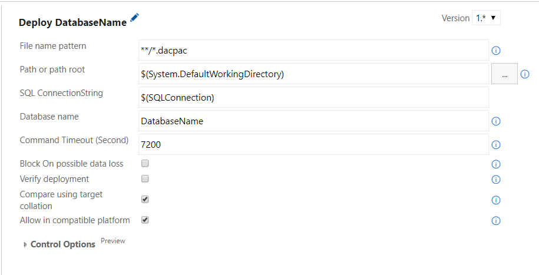

<!-- [PT-BR](readme.md) -->
# **What is?**

The SQLServer Deploy is a set of scripts that are able to perform the publication of the structure of your database (MS SQL Server) based on the selected .dacpac file.

# **How it works?**

The executed script searches for a file that matches the pattern entered, connects to the database using the connection string, instantiates a class, from the SDDT package, configures the execution of the publication, and executes deploy.

You need change the file name pattern for select one unique file, case your path has multiple.

## Deploy one database by task

## Deploy multiple database by task on same server

# **Requirements:**
For this task to run the "Agent" running server must have installed SQL Server Data Tools in the directory C:\Program Files (x86)\Microsoft SQL Server\120+\DAC\bin\Microsoft.SqlServer.Dac.dll

[Link para download](https://docs.microsoft.com/pt-br/sql/ssdt/download-sql-server-data-tools-ssdt)

## **To collaborate:**
  
